Parts Implemented by Emre KÖSE
================================

**2.ARKADAŞLIK BÖLÜMÜ KODLAMA DETAYLARI**
------------------------------------------

**Bölümde kullanılan veritabanı fonksiyonları**

    Arkadaşlar kısımında ve diğer kısımlarda kullanılan sql veritabanı dili ile gerçekleştirilen uygulama fonksiyonları connect_db.py dosyasında bulunmaktadır.Benim kısmımda kullanılan fonksiyonlar ve açıklamaları şu şekildedir:
    
**a- Tabloları oluşturma fonksiyonu**

Arkadaşlar bölümünde üç farklı tablo kullanılmıştır. Bu tablolar:

-	     PERSONFRIENDS tablosu kişilerin kullanıcıadı, isim, soyisim ve takma isim özelliklerini tutar. Kullanıcı adı uygulamaya girişte(login) alınan username e dış anahtarlama ile bağlıdır.Giriş yapıldıktan sonra nickname özelliği otomatik olarak eklenir. 
 
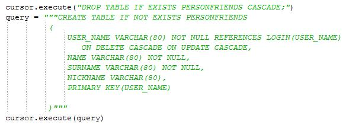
   
   Resim 1: PERSONFRIENDS tablosu oluşturma 

-   FRIENDSRELATION tablosu iki farklı username tutar. Bunun manası birinci username ikinci username ile arkadaş olduğudur. Dış anahtarlama ile PERSONFRIENDS tablosuna bağlıdır. 
 

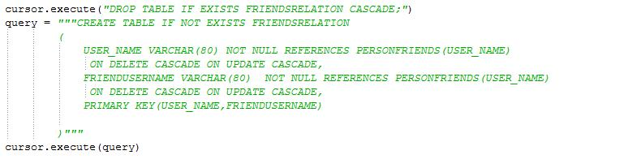
   
   Resim 2: FRIENDSRELATION tablosu oluşturma 
   
-   CANDIDATE_FRIENDS tablosu iki farklı username tutar. Bu tablodan birinci username ikinci username ile tanışık olma ihtimali olduğu anlaşılır. Bu tablonun içeriğinin oluşma şekli ise ortak arkadaşlık ilişkileri kontrol edilerek yapılır.
 

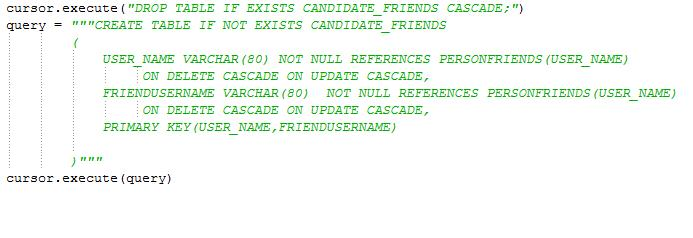
   
   Resim 3: CANDIDATE_FRIENDS tablosu oluşturma 

**b- Tablolarda gerçekleştirilen ekleme – silme – güncelleme fonksiyonları**

    - insert_to_person_friends fonksiyonu uygulamaya kayıt esnasında kullanılarak bazı bilgilerin ekleme yapılarak personfriends tablosuna ekleme amaçlıdır.

 
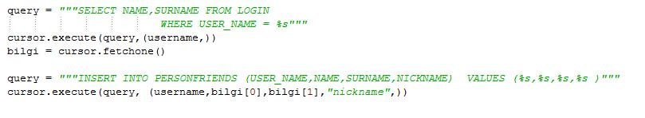
   
   Resim 4: insert_to_person_friends fonksiyonu 
   
   
    -ekle_arkadas fonksiyonu adında da anlaşılacağı üzere arkadaş eklendiğinde friends_relation tablosuna eklenen arkadaşın kullanıcı adını ekler.Ancak öncesinde bu kişinin PERSONFRIENDS dolayısıyla LOGIN tablosunda olup olmadığını kontrol eder.

 
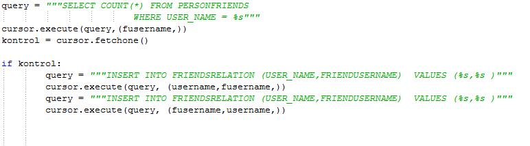
   
   Resim 5: ekle_arkadas fonksiyonu 

-sil_arkadas fonksiyonu listelenen arkadaşların silinmesi esnasında kullanılır.Değişken olarak iki username alır ve bunları arkadaş ilişkilerini tutan FRIENDSRELATION tablosuna yansıtır.
 

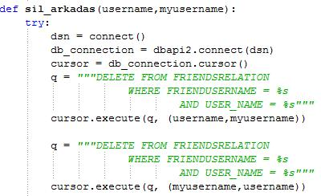
   
   Resim 6: sil_arkadas fonksiyonu 

-yakın_arkadas_bul fonksiyonu, kullanıcının kendi arkadaşlarının => arkadaşlarını elde edip daha sonra bu username leri kendi arkadaşlarından ve kendi username inden çıkartarak ortaya çıkan bir fonksiyondur. Bu bilgiler ise candidate_friends tablosuna eklenir.

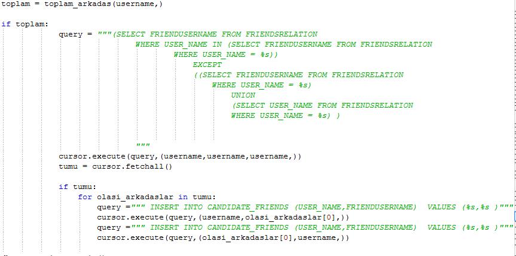
   
   Resim 7: yakın_arkadas_bul fonksiyonu 

-guncelle_arkadas fonksiyonu kişinin kendine özgü olan takma adını(nickname) güncelleyebilmesi için oluşturulmuştur.
 

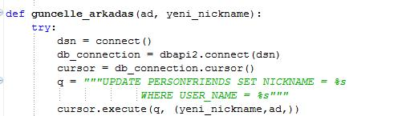
   
   Resim 8: guncelle_arkadas fonksiyonu 

c- Tablolarda bulunan bilgileri elde etmek için oluşturulan fonksiyonlar:

-gonder_username fonksiyonu kullanıcının arkadaş bilgilerini tablodan çekmek için kullanılır.
 
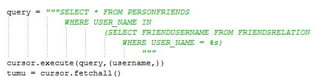
   
   Resim 9: gonder_username fonksiyonu 

-yakin_arkileri_al fonksiyonu CANDIDATE_FRIENDS tablosundaki bilgileri çekmek amacıyla oluşturulmuştur.
 

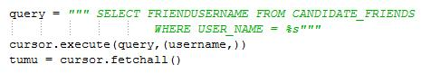
   
   Resim 10: yakin_arkileri_al fonksiyonu 

-toplam_arkadas fonksiyonu kullanıcının toplamda kaç adet arkadaşı olduğunu hesaplatmak için kullanılan bir fonksiyondur.
 

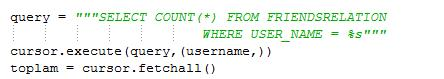
   
   Resim 11: toplam_arkadas fonksiyonu 

-get_myinfos fonksiyonu kullanıcının kendi bilgilerini PERSONFRIENDS tablosundan çekmek için oluşturulmuştur.
 

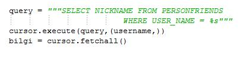
   
   Resim 12: get_myinfos fonksiyonu 

**Bölümde kulanılan html-veritanı ilişkisi kuran fonksiyonlar**
--------------------------------------------------------------

  Bu fonksiyonlar page_handlers.py içerisinde bulunur. Connect_db.py dosyasındaki sql komutlarının çağırıldığı ve arkadas.html sayfasında değişikliğin gerçekleşmesini sağlayan fonksiyonlardır. Bunlardan gonder_fr fonksiyonu uygulamada session olarak tutulan username i alarak daha sonrasında, arkadaşlar bölümüne gidilmek istendiğinde çağırılır ve bu sayfada kullanılacak bilgiler connect_db.py  fonksiyonları ile içerisinde çağırılarak elde edilir ve yansıtılır.
 
 gonder_fr fonksiyonunda connect_db.py dan çağırılan fonksiyonlar aşağıdaki resimde gözükmektedir.
 Burada da görüldüğü gibi myinfo kullanıcının kendi bilgilerini sayfaya yansıtır.
 tumu  o kullanıcının arkadaş bilgilerini sayfaya yansıtır.
 toplamarkadas toplam arkadaş sayısını ve de yakin_arkileri_al fonksiyonu connect_db.py dan çalışarak olası arkdaş bilgilerini sayfaya    yansıtır.
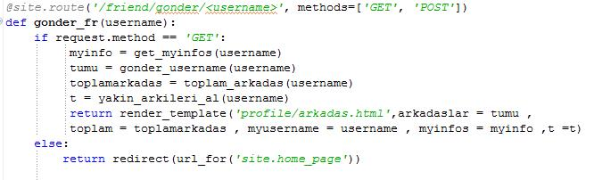
   
   Resim 13: gonder_fr fonksiyonu 

Diğer fonksiyonlar ise ekleme, silme ve güncelleme özellikleri kullanıldığı zaman çağırılarak gerekli sql fonksiyonlarının çağırılmasını sağlar.

Ekleme özelliği kullanıldığında çağırılan fonksiyon:
 

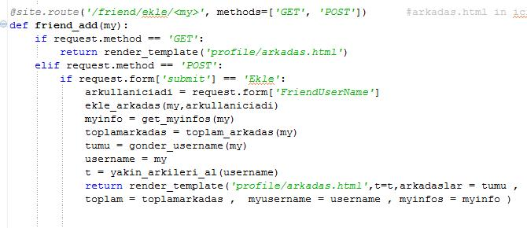
   
   Resim 14: friend_add fonksiyonu 
   
   
Güncelleme özelliği kullanıldığında çağırılan fonksiyon:
 

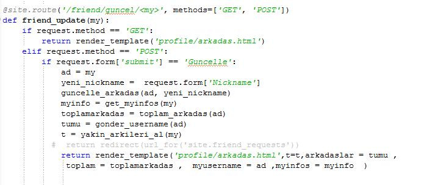
   
   Resim 15: friend_update fonksiyonu 

   Silme özelliği kullanıldığında çağırılan fonksiyon:
 

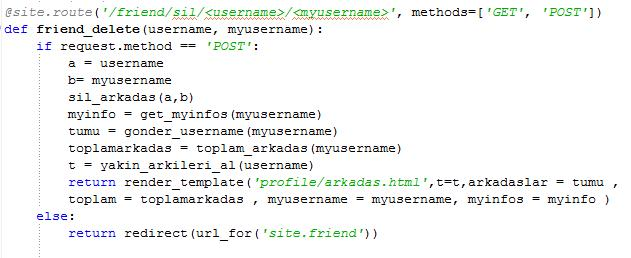
   
   Resim 16: friend_delete fonksiyonu 

**3.SONUÇ**
-----------

**Bölüm özeti**

Özetlemek gerekirse arkadaşlar bölümü kullanıcının kendi arkadaşlarını toplam arkadaş sayısı ile birlikte görebileceği, istediği arkadaşını silme butonu ile silebileceği, username ‘ini girerek tanıdığı arkadaşlarını ekleyebileceği, kendi takma adını güncelleyebileceği gibi özellikler içermektedir. Bunların yanında tanıyor olabileceği arkadaşların da listelendiği bir bölümdür.

**Bölüm Değerlendirme**
Projede istenen 3 farklı varlık oluşturuldu. Varlıklar üzerinde ekleme, silme ,güncelleme ve seçme gibi fonksiyonlar da kullanıldı. Bunlara ek olarak bana göre bölümün eksik ve tamamlanması gereken bölümleri olarak  şunu görmekteyim:
Arkadaş eklemeden önce eklenecek kişiye istek gönderilmesi ve isteğin kabul edilmesiyle eklemenin tamamlanması ( Neden: html bilgisi eksikliği - zaman kısıtı ) .

Kişisel olarak fikrim, bu projede daha çok html işleriyle uğraşmanın can sıkıcı olduüu ve projede veritabanı bilgimin gerçekten kullandığım yer olarak yakın arkadaşları bulma fonksiyonu olarak görmekteyim.
