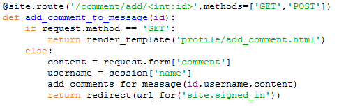

Parts Implemented by Furkan Artunç
==================================

**Zaman Tüneli Paylaşım Sistemi**
---------------------------------

    Bu bölümde yazılım geliştiriciler ve uygulamanın yazılım kısmıyla da ilgilenenler için, uygulamanın zaman tüneli kısmında kullanılan yazılımsal sistemle ilgili ayrıntılara yer verilecektir. Arka planda çalışan python kodları ve database sorguları gösterilecek .
  
.. figure::  1.png
   :figclass: align-center 
  
  Resim 1: Mesaj Sınıfı Tanımlaması
  
    Mesaj sınıfının gerekli değerleri tutması için tanımlaması yapılmıştır ve Resim 1’de bu sınıf gösterilmiştir.
  

   Resim 2: Zaman tüneli sayfasına yönlendirme yapan fonksiyon
   
      Resim 2’deki kod parçası zaman tüneli sayfasının çağrılmasıyla ilgili işlemleri yapmaktadır. 
   
    Bu fonksiyon iki şekilde yöntemle çağrılmaktadır “GET” ve “POST”. “GET” metoduyla çağrıldığı zaman veritabanından aldığı mesajları ekrana basmaktadır. Ayrıca kullanıcı adını giriş yapmış olan kullanıcının dönemlik girişinden almaktadır. Bu fonksiyonun içerisinde Flask kütüphanesinin sağladığı “render_template()” ve redirect() fonksiyonları kullanılmıştır.
   

   
   Resim 3: Mesaj ekleme sayfa yönlendiricisi fonksiyon
   
      Resim 3’te gösterilen fonksiyon mesaj ekleme sayfası için bir yönlendirme fonksiyonudur. Bu fonksiyon iki yöntemle çağrılabilir “GET” ve “POST”. Bu fonksiyon “GET” yöntemiyle çağrılırsa mesajla ilgili gerekli bilgileri doldurmak için yapılan html sayfasına yönlendirme yapmaktadır. Eğer “POST” yöntemi kullanılırsa, form verilerinden verileri alıp, bu verilerle veritabanında ekleme yapmakta ve sonrasında zaman tüneli sayfasına dönüş yapmaktadır.
   

   
   Resim 4: Mesaj silme sayfası yönlendiricisi
   
   Resim 4’te gösterilen kod parçası mesaj silme sayfası için yönlendirme yapmaktadır. “POST” yöntemiyle çağrıldığında sayfadan mesaj kimlik numarasını alıp, veritabanından bu numaraya göre mesajı bulup silmekte ve sonrasında zaman tüneli sayfasına yönlendirme yapmaktadır.
   

   
   Resim 5: Mesaj güncelleme sayfası yönlendiricisi
   
   Resim 5’te verilen kodda bir mesajı güncellemek için gereken sayfa için yönlendirme yapma işlemi gerçekleşmektedir. Bu fonksiyon parametre olarak mesaj kimlik numarasını almaktadır.“POST” yöntemiyle çağrıldığında sayfadan güncelleme bilgilerini alır ve gerekli değişiklikleri veritabanındaki tabloya aktarır, bu aktarım sonunda zaman tüneline yönlendirme yapar. “GET” yöntemiyle çağrıldığında ise mesaj güncelleme için bilgilerin alındığı sayfaya yönlendirme yapmaktadır. 
   

   
   Resim 6: Mesaja yorum ekleme sayfası yönlendiricisi
   
   Resim 6’da gösterilen kod parçası bir mesaj için yorum ekleme sayfasına yönlendirme işlemini yapmaktadır. Bu fonksiyon parametre olarak mesajın kimlik numarasını almaktadır.Böylece hangi mesaja yorum yazıldığını belirlemektedir.Bu fonksiyon “POST” yöntemiyle çağrıldığında yorum ekleme sayfasından aldığı gerekli bilgileri mesaj kimliğine göre veritabanına eklemekte ve zaman tüneli sayfasına yönlendirme yapmaktadır. “GET” yöntemiyle çağrıldığında ise güncelleme için gerekli form bilgilerinin alınacağı sayfaya yönlendirme yapmaktadır.
   
   **Buraya kadar zaman tüneliyle ilgili sayfa yönlendirme fonksiyonları anlatılmıştır. Buradan sonra veritabanıyla ilgili fonksiyonlar anlatılacaktır.**

   
   Resim 7: Zaman tüneli paylaşımları ile ilgili tabloların oluşturulması
   
   Resim 7’de gösterilen fonksiyon zaman tüneliyle ilgili tabloların oluşturulmasını sağlamaktadır. En başta database bağlantısını sağlamakta ve sonrasında postgresql komutlarını çalıştırmaktadır.Oluşabilecek ve oluşan hatalarda hata verip yapılan değişikliği geri almaktadır. En sonda database bağlantısını sonlandırmaktadır. 

   
   Resim 8: Veritabanı mesajlarını alma fonksiyonu
   
   Resim 8’de gösterilmiş olan kod veritabanında mesaj tablosundaki mesajların hepsini almakta ve bunu döndürmektedir. Mesaj tablosundaki bütün sütunlar alınmaktadır. Bu fonksiyon zaman tüneline mesajları bastırmak için kullanılan sayfa ayarlayıcısında kullanılmıştır. Öncelikle veritabanı bağlantısı kurmakta ve sonrasında postgresql komutunu çalıştırmaktadır. Eğer hata olursa, hata mesajı vermekte ve yapılan değişiklikleri geri almaktadır. Son olarak veritabanı bağlantısını sonlandırmaktadır.
   

   
   Resim 9: Veritabanına mesaj ekleme fonksiyonu
   
   Resim 9’daki kod, parametre olarak aldığı mesaj objesinin elemanlarını mesaj tablosuna eklemketedir. Veritabanı bağlantısını başta kurup sonda sonlandırmaktadır. Hata olursa yapılan değişiklikleri geri almaktadır.
   

   
   Resim 10: Veritabanından mesaj silme fonksiyonu
   
   Resim 10’da gösterilen kod, veritabanından istenen mesajı silmektedir. Hangi mesajın silineceğine parametre olarak aldığı mesaj kimlik numarasıyla karar vermektedir. Bu numaraya göre veritabanına bakıp uygun mesajı mesaj tablosundan çıkarmaktadır. 
   

   
   Resim 11: Veritabanındaki mesajı güncelleme fonksiyonu
   
   Yukarıda gösterilen fonksiyon veritabanındaki mesajın içeriğini ve konusunu güncellemektedir. Hangi mesajda güncelleme yapacağına parametre olarak aldığı mesaj kimlik numarasıyla karar vermektedir. Güncelleme yapacağı içerik ve konu bilgilerini de parametre olarak alır. 
   

   
   Resim 12: Yorumları alma fonksiyonu
   
   Yukarıdaki fonksiyon veritabanındaki yorum tablosundan tüm sütunları almaktadır. Alınan yorumları bir veri yapısı olarak döndürmektedir. Bu fonksiyon da zaman tüneliyle ilgili sayfa işlemlerini yapan ve girdileri ekrana bastıran fonksiyon tarafından kullanılmıştır. Başta veritabanı bağlantısı kurup sonda kapatmaktadır. Eğer hatalı bir durum oluşursa hata mesajı verip yapılan değişiklikleri geri almaktadır.
  

   
   Resim 13: Mesaja yorum ekleme fonksiyonu
   
   Yukarıda gösterilen fonksiyon bir yorum tablosuna yorum eklenmesini sağlar.Parametre olarak yorum içeriği,yorumu yazan kişinin kullanıcı adı ve yorum kimlik numarasını almaktadır. Yorum kimlik numarası mesaj kimlik numarasına göre alındığı için mesaj tablosundaki mesajlarla ilişkinin başarımı yapılmış olur. Böylece hangi yorumun hangi mesaja ait olduğu yorum kimlik numarasından belirlenir. Başta kurulan veritabanı bağlantısı sonda kesilir. Eğer hatalı bir durum oluşursa hata mesajı bastırılır ve yapılan değişiklikler geri alınır.
   
