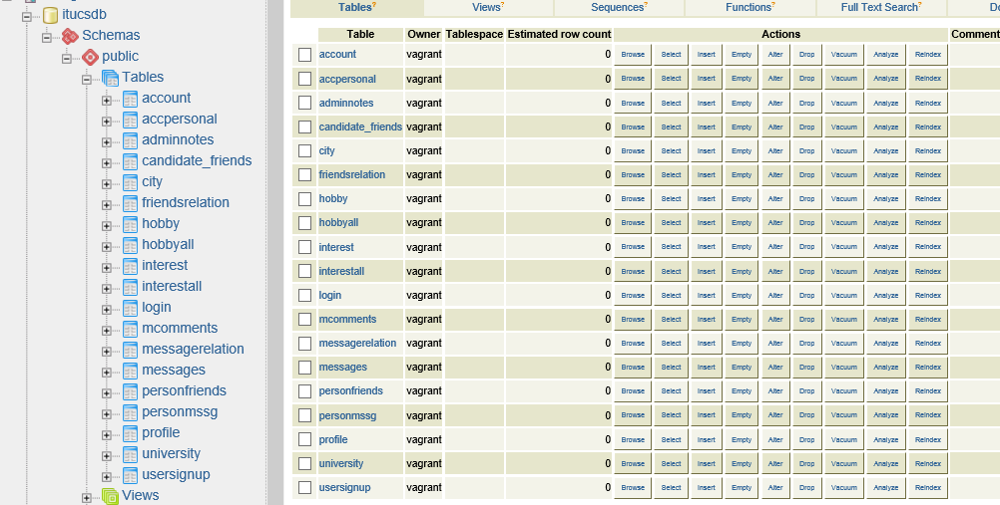
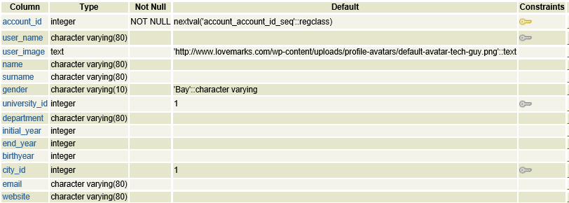
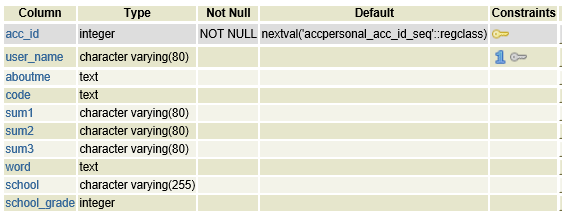
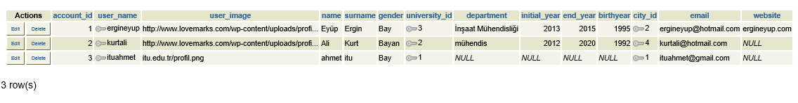
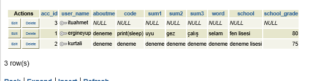
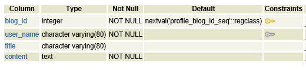

Parts Implemented by Tuncay Demirbaş
================================
Genel
-----
Bu projede sorumlu olduğum kısım için sırayla:

* account (profil sayfası kişisel bilgiler için, tablo)
* accpersonal (profil sayfası kişisel bilgiler için, tablo)
* city (şehir tablosu)
* university (üniversite tablosu)
* hobby (hobi tablosu)
* hobbyall (profil sayfasına hobi ekleme için, tablo)
* interest (ilgi alanları tablosu)
* interestall (profil sayfasına ilgi alanı ekleme için, tablo)
* profile (profil sayfasına blog ekleme için, tablo)

olmak üzere 9 tane varlık geliştirdim. 
Ayrıca bu varlıklar için aşağıda tanımadığım fonksiyonları geliştirdim.
Tüm varlıklar birbiriyle ilişkişi olup, dinamik tablolar oluşturulmuştur.

   
   Resim 1: Veritabanı genel görünümü, tablolar

Operasyonlar
------------

* Tablo Oluşturma
 Bu operasyonu tabloları yaratmak için oluşturdum. Bu operasyon sırasında öncelikle eğer tablo varsa drop yapılır. Daha sonra bu
 tablolar istenilen özelliklerle yaratılır.
* Ekleme
 Bu operasyonu yeni tablolarımıza yeni eleman eklemek için kullandım. 
* Silme
 Bu işlem tablolarımızdan artık bulunmasını istemediğimiz elemanları silmek için kullanılıyor.
* Güncelleme
 Bu işlem ise bazı bilgilerini değiştirmek istediğimiz elemanların verilerini değiştirmek için kullanılıyor.
* Arama
 Bu işlemde belirli bir özelliğe göre tablodan elemanları aramamız için kullanılıyor. 
 
 tablolarının içerikleri ve yeni çoklu ekleme, varolan çokluyu silme, güncelleme arama gibi veritabanı işlemleri bu kısımda açıklanmıştır.
 
1. Account ve Accpersonal (profil sayfası kişisel bilgiler için, tablo)
---------
 
 Kullanıcı tablosu ile ilişkili olan sayfam,
Öncelikle kullanıcının ;
sisteme üye olması ve giriş yapması gerekir.
Üye olduğu an, üye olan kullanıcı ile ilgili profil sayfamda ilgili tablolara kayıt olan kullanıcının kullanıcı adına göre Ekleme işlemi gerçekleştirilir.

.. code-block:: python

        newAccount = Addaccount(username, name, surname, email)
        add_to_login(newRecord)
        add_account_to_table(newAccount)
        add_accountpersonal_to_table(username)
        
Account Tablosunun genel görünümü şöyledir:

   
   Resim 2: Account Tablosu
   
Gördüğünüz üzere Account Tablosunda birçok sütun bulunmakta.
* user_name
* university_id
* city_id
sütunları dış anahtar ile diğer tablolara bağlanmıştır.
Resim 2'de gördüğünüz tabloyu oluşturmak için şu kodları yazdım:

.. code-block:: python

           cursor.execute("DROP TABLE IF EXISTS ACCOUNT CASCADE;")
           query = """CREATE TABLE IF NOT EXISTS ACCOUNT
                (
                    ACCOUNT_ID SERIAL PRIMARY KEY,
                    USER_NAME VARCHAR(80),
                    USER_IMAGE TEXT DEFAULT 'http://www.lovemarks.com/wp-content/uploads/profile-avatars/default-avatar-tech-guy.png',
                    NAME VARCHAR(80),
                    SURNAME VARCHAR(80),
                    GENDER VARCHAR(10) DEFAULT 'Bay',
                    UNIVERSITY_ID INTEGER DEFAULT 1,
                    DEPARTMENT VARCHAR(80),
                    INITIAL_YEAR INTEGER,
                    END_YEAR INTEGER,
                    BIRTHYEAR INTEGER,
                    CITY_ID INTEGER DEFAULT 1,
                    EMAIL VARCHAR(80),
                    WEBSITE VARCHAR(80),
                    FOREIGN KEY (USER_NAME)  REFERENCES LOGIN(USER_NAME) ON DELETE CASCADE ON UPDATE CASCADE,
                    FOREIGN KEY (UNIVERSITY_ID)  REFERENCES UNIVERSITY(UNIVERSITY_ID) ON DELETE CASCADE ON UPDATE CASCADE,
                    FOREIGN KEY (CITY_ID)  REFERENCES CITY(CITY_ID) ON DELETE CASCADE ON UPDATE CASCADE
                )"""
        cursor.execute(query)
        
Yukarıdaki kod diliminde ACCOUNT tablosu oluşturulmuştur. ACCOUNT tablosu daha önce oluşturulduysa o tablo silinir ve sıfırdan yeni tablo oluşturulur. Kodun bu partında birincil anahtar ve dış anahtarlar da belirlenmiştir. Bağlı olduğu diğer tablolardaki değişikliklerden etkilenme biçimleri de (ON DELETE CASCADE , ON UPDATE CASCADE) yine bu kısımda belirtilmiştir. Profil resmi eklemeyenler için "defaultprofil.png" öntanımlı değişken olarak tanımlanmıştır.

ACCPERSONAL Tablosunun genel görünümü şöyledir:

   
   Resim 3: ACCPERSONAL Tablosu
   
Gördüğünüz üzere Account Tablosunda birçok sütun bulunmakta.
* user_name
sütunu dış anahtar ile diğer tabloya bağlanmıştır.
Resim 3'de gördüğünüz tabloyu oluşturmak için şu kodları yazdım:

.. code-block:: python

        cursor.execute("DROP TABLE IF EXISTS ACCPERSONAL CASCADE;")
        query = """CREATE TABLE IF NOT EXISTS ACCPERSONAL
                (
                    ACC_ID SERIAL PRIMARY KEY,
                    USER_NAME VARCHAR(80) UNIQUE,
                    ABOUTME TEXT,
                    CODE TEXT,
                    SUM1 VARCHAR(80),
                    SUM2 VARCHAR(80),
                    SUM3 VARCHAR(80),
                    WORD TEXT,
                    SCHOOL VARCHAR(255),
                    SCHOOL_GRADE INTEGER,
                    FOREIGN KEY (USER_NAME)  REFERENCES LOGIN(USER_NAME) ON DELETE CASCADE ON UPDATE CASCADE
                )"""
        cursor.execute(query)
        
Yukarıdaki kod diliminde ACCPERSONAL tablosu oluşturulmuştur. ACCPERSONAL tablosu daha önce oluşturulduysa o tablo silinir ve sıfırdan yeni tablo oluşturulur. Kodun bu partında birincil anahtar ve dış anahtarlar da belirlenmiştir. Bağlı olduğu diğer tablolardaki değişikliklerden etkilenme biçimleri de (ON DELETE CASCADE , ON UPDATE CASCADE) yine bu kısımda belirtilmiştir.

Mevcut profil için kullanıcının profil bilgilerini güncellemesi için oluşturulan bu tabloların oluşturulması için şöyle bir yöntem izlenmiştir.
Kullanıcı sisteme üye olduğu andan itibaren hemen, Yukarıda da göstermiş olduğum 
 * add_account_to_table(newAccount)
 * add_accountpersonal_to_table(username)
ilgili kod kısmında insert fonksiyonları çalıştırılır ve ilgili kullanıcıya özel,
her iki tabloda da birer kayıt oluşturulur.

**ACCOUNT Insert Komutu:**

.. code-block:: python

   def add_account_to_table(addaccount):
    try:
        dsn = connect()
        db_connection = dbapi2.connect(dsn)
        cursor = db_connection.cursor()
        query = """INSERT INTO ACCOUNT (USER_NAME,NAME,SURNAME,EMAIL) VALUES (%s,%s,%s,%s) """
        cursor.execute(query,(addaccount.user_name,addaccount.name,addaccount.surname,addaccount.email))
        db_connection.commit()
        db_connection.close()

    except dbapi2.DatabaseError as error:
        print("Error %s" % error)
        
Insert ile ilgili kod kısmından Görüldüğü üzere sisteme üye olan kullanıcının sırayla
* user_name
* name
* surname
* email
bilgileri alınıp ACCOUNT tablosuna insert ediliyor. Böylelikle ilgili kullanıcıya ait bölüm oluşturulmuş olundu.

**ACCPERSONAL Insert Komutu:**

.. code-block:: python

   def add_accountpersonal_to_table(username):
    try:
        dsn = connect()
        db_connection = dbapi2.connect(dsn)
        cursor = db_connection.cursor()
        query = """INSERT INTO ACCPERSONAL (USER_NAME) VALUES (%s) """
        cursor.execute(query,[username])
        db_connection.commit()
        db_connection.close()

    except dbapi2.DatabaseError as error:
        print("Error %s" % error)
        
Insert ile ilgili kod kısmından Görüldüğü üzere sisteme üye olan kullanıcının sırayla
* user_name
bilgisi alınıp ACCPERSONAL tablosuna insert ediliyor. Böylelikle ilgili kullanıcıya ait bölüm oluşturulmuş olundu. 

Kullanıcıya ait oluşan bu iki tablo bundan sonra hep güncelleme işlemini gerçekleştirecek, Sırayla açıklamak gerekirse:

* Kişisel bilgiler menüsü kod kısmı

Kullanıcı kendi kişisel bilgilerini **User Guide** kısmında anlattığım şekilde, Profili düzenle kısmından yönetim paneline girip kişisel bilgilerini güncelleyecektir.

Kullanıcın HTML formlarına gerekli bilgileri girmesinin ardından ve sonra Güncelle butonuna basmasıyla
aşağıdaki ilgili kod parçacığı çalıştırılacaktır.

.. code-block:: python

   @site.route('/admin/kisisel',methods=['GET','POST'])
   def admin_kisisel():
    if request.method == 'GET':
        profile_account = get_account_from_table(session['name'])
        profile_university = get_university_from_table()
        profile_city = get_city_from_table()
        return render_template('admin/kisisel.html', profile_account = profile_account, profile_university= profile_university, profile_city=profile_city)
    else:
       ## usr_session = session['name']
            username    = request.form['username']
            ad          = request.form['ad']
            soyad       = request.form['soyad']
            resim       = request.form['resim']
            cinsiyet    = request.form['cinsiyet']
            universite  = request.form['universite']
            bolum       = request.form['bolum']
            giris       = request.form['giris']
            bitis       = request.form['bitis']
            dogum       = request.form['dogum']
            sehir       = request.form['sehir']
            eposta      = request.form['eposta']
            web         = request.form['web']
            update_account_from_table(username,ad,soyad,resim,cinsiyet,universite,bolum,giris,bitis,dogum,sehir,eposta,web)
            return redirect(url_for('site.admin_kisisel'))
            
Yukarıdaki kod parçacığında kullanıcın HTML formlarına girdiği bilgiler **request.form** ile alınıp bir değişkene atanıp fonksiyon aracılığıyla  **update_account_from_table** 'e gönderilir bilgiler.

**update_account_from_table Kod bloğu**

.. code-block:: python

   def update_account_from_table (username,ad,soyad,resim,cinsiyet,universite,bolum,giris,bitis,dogum,sehir,eposta,web):
    try:
        dsn = connect()
        db_connection = dbapi2.connect(dsn)
        cursor = db_connection.cursor()
        query = """UPDATE ACCOUNT SET
        USER_IMAGE=%s, NAME=%s, SURNAME=%s, GENDER=%s, UNIVERSITY_ID=%s, DEPARTMENT=%s, INITIAL_YEAR=%s,
        END_YEAR=%s, BIRTHYEAR=%s, CITY_ID=%s , EMAIL=%s , WEBSITE=%s
        WHERE USER_NAME=%s"""
        cursor.execute(query,(resim,ad,soyad,cinsiyet,universite,bolum,giris,bitis,dogum,sehir,eposta,web,username))
        db_connection.commit()
        db_connection.close()
    except dbapi2.DatabaseError as error:
        print("Error %s" % error)
        
update_account_from_table kod bloğunda görmüş olduğunuz üzere, fonksiyon aracağıyla gönderilen bilgiler, UPDATE sql komutuna işletilip, güncelleme işlemi gerçekleştiriliyor.

* Tanıt Kendini menüsü kod kısmı

Kullanıcı kendi kişisel bilgilerini **User Guide** kısmında anlattığım şekilde, Profili düzenle kısmından yönetim paneline girip kişisel bilgilerini güncelleyecektir.

Kullanıcın HTML formlarına gerekli bilgileri girmesinin ardından ve sonra Güncelle butonuna basmasıyla
aşağıdaki ilgili kod parçacığı çalıştırılacaktır.

.. code-block:: python

   @site.route('/admin/kisiselekbilgi',methods=['GET','POST'])
   def admin_tanitma():
    if request.method == 'GET':
        profile_account = get_accountpersonal_from_table(session['name'])
        return render_template('admin/tanitma.html',  profile_account = profile_account)
    else:
        username    = request.form['username']
        hakkimda    = request.form['hakkimda']
        kod         = request.form['kod']
        sum1         = request.form['sum1']
        sum2        = request.form['sum2']
        sum3         = request.form['sum3']
        soz         = request.form['soz']
        lise         = request.form['lise']
        ort         = request.form['ort']
        update_accountpersonal_from_table(username,hakkimda,kod,sum1,sum2,sum3,soz,lise,ort)
        return redirect(url_for('site.admin_tanitma'))
            
Yukarıdaki kod parçacığında kullanıcın HTML formlarına girdiği bilgiler **request.form** ile alınıp bir değişkene atanıp fonksiyon aracılığıyla  **update_accountpersonal_from_table** 'e gönderilir bilgiler.

**update_accountpersonal_from_table Kod bloğu**

.. code-block:: python

   def update_accountpersonal_from_table(username,hakkimda,kod,sum1,sum2,sum3,soz,lise,ort):
    try:
        dsn = connect()
        db_connection = dbapi2.connect(dsn)
        cursor = db_connection.cursor()
        query = """UPDATE ACCPERSONAL SET
        ABOUTME=%s , CODE=%s, SUM1=%s, SUM2=%s, SUM3=%s, WORD=%s, SCHOOL=%s, SCHOOL_GRADE=%s
        WHERE USER_NAME=%s"""
        cursor.execute(query,(hakkimda,kod,sum1,sum2,sum3,soz,lise,ort,username))
        db_connection.commit()
        db_connection.close()
    except dbapi2.DatabaseError as error:
        print("Error %s" % error)
        
update_accountpersonal_from_table kod bloğunda görmüş olduğunuz üzere, fonksiyon aracağıyla gönderilen bilgiler, UPDATE sql komutuna işletilip, güncelleme işlemi gerçekleştiriliyor.

gerekli güncelleme işlemleri sonrası veritabanında ACCOUNT ve ACCPERSONAL tablolarının kayıt görünümü şöyle olacaktır sırayla:

   
   Resim 4: ACCOUNT Tablosundaki kayıtlar
   

   
   Resim 5: ACCPERSONAL Tablosundaki kayıtlar   
   
2. Profile (profil sayfası blog işlemleri, tablo)
--------

Sistemdeki kayıtlı kullanıcı giriş yaptığı kullanıcı adıyla profil sayfasında her türlü değişikliği yapabilir, 
birden fazla Blog ekleyebilir, düzenleyebilir, silebilir. kısacası **CRUD** işlemlerinin hepsi yapılmaktadır.

   
   Resim 6: profile tablosu genel görünümü
   
Tüm sütunlar varlık içerisinde tanımlanmıştır ve user_name ile relation sağlanmıştır.

Kullanıcı profil sayfasına girip,
Blog kısmında, kullanıcı kendi kişisel sayfası için istediği kadar blog ekleyebilir, silebilir, güncelleyebilir, ve son olarak
her kullanıcının profil sayfasından URL uzatısı **profile/<user-name>** olduğu için, GET metodu ile user_name alınıp SELECT komutu ile ve WHERE koşulu ile sadece ilgili kullanıcıya özel blog yazılarının getirilmesi sağlanmıştır.

**Blog tablosnun create edilmesi**

.. code-block:: python

   def init_profile_table():
    try:
        dsn = connect()
        db_connection = dbapi2.connect(dsn)
        cursor = db_connection.cursor()
        cursor.execute("DROP TABLE IF EXISTS PROFILE CASCADE;")
        query = """CREATE TABLE IF NOT EXISTS PROFILE
                (
                    BLOG_ID SERIAL PRIMARY KEY,
                    USER_NAME VARCHAR(80) NOT NULL,
                    TITLE VARCHAR(80),
                    CONTENT TEXT NOT NULL,
                    FOREIGN KEY (USER_NAME)  REFERENCES LOGIN(USER_NAME) ON DELETE CASCADE ON UPDATE CASCADE
                )"""
        cursor.execute(query)
        
Yukarıdaki kod diliminde PROFILE tablosu oluşturulmuştur. PROFILE tablosu daha önce oluşturulduysa o tablo silinir ve sıfırdan yeni tablo oluşturulur. Kodun bu partında birincil anahtar olarak BLOG_ID belirlenmiştir. ve ON DELETE CASCADE ON UPDATE CASCADE işlemleri yapılmıştır. relation sağlanmıştır diğer tablolarla.

zaten en üstte belirttiğim gibi proje çalıştırıldığı gibi **server.py** de init_profile_table komutu işletilir ve tüm tablolar başlangıçta CREATE edilir.

* Blog Ekleme işlemi

.. code-block:: python

   @site.route('/admin/blog/add',methods=['GET','POST'])
   def add_blog():
    if request.method == 'GET':
        return render_template('admin/blog_ekle.html')
    else:
        user_name = session['name']
        title = request.form['title']
        content = request.form['content']
        newProfile = Profile(user_name,title,content)
        add_profile_to_table(newProfile)
        return redirect(url_for('site.blog'))
        
HTML formlarından alınan bilgiler fonksiyon aracılığıyla  önce   Profile.py tanımlı olan koda işletilir.

**Profil.py**

.. code-block:: python

   class Profile:
    def __init__(self,user_name,title,content):
        self.user_name = user_name
        self.title = title
        self.content = content    
        
Profile ile işletilen veriler, newProfile  değişkenine aktarılır ve ordan da   add_profile_to_table fonskiyonuna gönderilir.

.. code-block:: python

   def add_profile_to_table(profile):
    try:
        dsn = connect()
        db_connection = dbapi2.connect(dsn)
        cursor = db_connection.cursor()
        query = """INSERT INTO PROFILE (USER_NAME,TITLE,CONTENT) VALUES (%s,%s,%s) """
        cursor.execute(query,(profile.user_name,profile.title,profile.content))
        db_connection.commit()
        db_connection.close()
        
Yukarıda belirtilen kod parçacığında ekleme işlemi gerçekleştirilir.

**Güncelleme Fonksiyonu**
.. code-block:: python

   def update_profile_from_table (title,content,blog_id):
    try:
        dsn = connect()
        db_connection = dbapi2.connect(dsn)
        cursor = db_connection.cursor()
        query = """UPDATE PROFILE SET TITLE=%s, CONTENT=%s WHERE BLOG_ID=%s"""
        cursor.execute(query,(title,content,blog_id))
        db_connection.commit()
        db_connection.close()
    except dbapi2.DatabaseError as error:
        print("Error %s" % error)

Aynı Add mantığında olduğu gibi kullanıcıdan HTML formları aracılığı ile bilgiler alınır ve sql kodu olarak işletilir.

**Silme Fonksiyonu**

.. code-block:: python

   def remove_profile_from_table(blog_id):
    try:
        dsn = connect()
        db_connection = dbapi2.connect(dsn)
        cursor = db_connection.cursor()
        query = """DELETE FROM PROFILE WHERE BLOG_ID = %s"""
        cursor.execute(query,(blog_id,))
        db_connection.commit()
        db_connection.close()
    except dbapi2.DatabaseError as error:
        print("Error %s" % error)
        
Silinmek istenen çoklunun birincil anahtarı olan BLOG_ID'sini alarak fonksiyona gönderir ve çokluyu siler.        

**Seçme Fonksiyonu ile ilgili kullanıcıya özel blogların getirilmesi**

.. code-block:: python

   def get_profile_from_table(asd):
    try:
        dsn = connect()
        db_connection = dbapi2.connect(dsn)
        cursor = db_connection.cursor()
        query = """SELECT BLOG_ID,USER_NAME,TITLE,CONTENT FROM PROFILE WHERE (USER_NAME = %s)"""
        cursor.execute(query,[asd])
        fetchedData = cursor.fetchall()
        db_connection.commit()
        db_connection.close()
        return fetchedData;

    except dbapi2.DatabaseError as error:
        print("Error %s" % error)
        
where komutu ile koşul belirtilip seçili kayıt getirilir sadece.

**3. İlgi alanı ve Hobi veritabanı kısmı**
-----------

Aşağıda belirtilen 4 varlık ile ilgili bilgiler verilecektir.

* hobby (hobi tablosu)
* hobbyall (profil sayfasına hobi ekleme için, tablo)
* interest (ilgi alanları tablosu)
* interestall (profil sayfasına ilgi alanı ekleme için, tablo)

bu 4 temel varlık profil sayfasına kullanıcın hobi ve ilgi alanları eklemesi veya bu ilgi alanları ve hobi listesindeki verilere yeni veriler eklemesi silmesi güncellemesini içerir.

