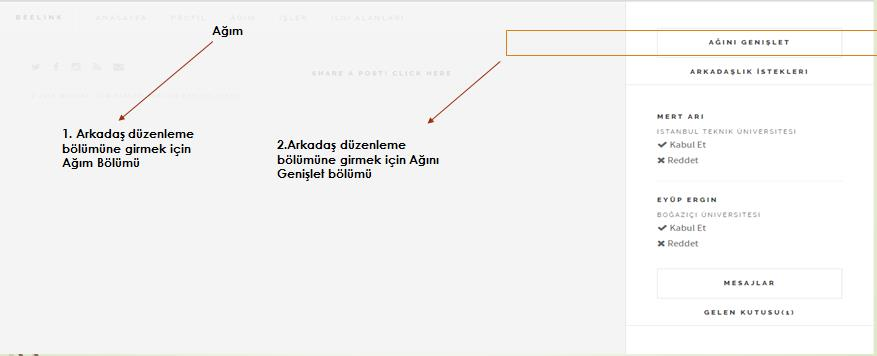
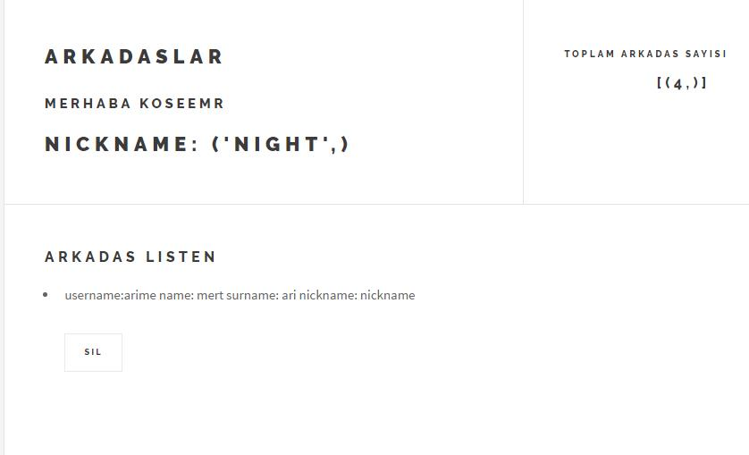
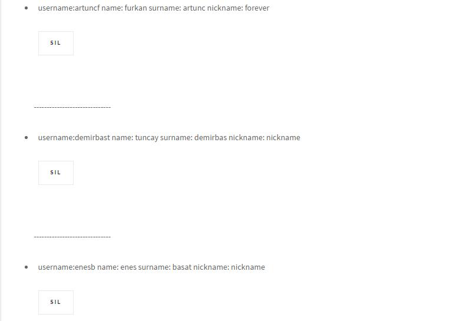
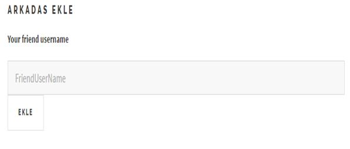
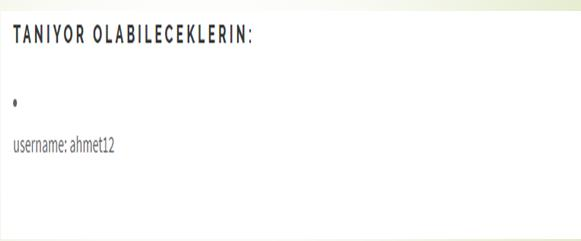

Parts Implemented by Emre KÖSE
================================

**ARKADAŞLAR BÖLÜMÜ**
---------

**1.	TANIM**
---------

-  Arkadaş bölümüne nasıl ulaşırım?

-  Bölüm işlevleri

**2.	BÖLÜM KODLAMA DETAYLARI**
---------

-	Bölümde kullanılan veritabanı fonksiyonları

-	Bölümde kulanılan html-veritanı ilişkisi kuran fonksiyonlar

**3.	SONUÇ** 
---------

-	Bölüm özeti

-	Bölüm değerlendirme

**1.	TANIM**
---------

**Arkadaş Bölümüne nasıl ulaşırım?**

     Siteye giriş yapıldıktan sonra üstte bulunan Ağım başlığından ya da sağ üstte bulunan zil simgesinde yer alan AĞINI GENİŞLET  kısımlarından arkadaşlar bölümüne geçiş yapabilir.
 

   
   Resim 1: Arkadaşlar bölümü ulaşım 

**Bölüm işlevleri**

Arkadaşlık bölümü isminden de anlaşılacağı üzere kullanıcının kişisel olarak arkadaş bilgilerinin ve bazı kişisel özelliklerinin bulunduğu bir bölümdür. Bu bölümün işlevlerini x ana başlıkta listeleyebiliriz.  

**1.	Arkadaş bilgileri**

Kullanıcının arkadaşlarının kullanıcı adının, isminin, soyisminin listelendiği ve de toplamda kaç arkadaşa sahip olduğunu görebildiği bir bölümdür.
 

   
   Resim 2: Arkadaşlar sayfası genel görünüm 
 

   
   Resim 3: Arkadaşlar bölümü genel görünüm

**2.	Kullanıcının arkadaş bölümü üzerindeki yetkileri**

Kullanıcı, username’ini bildiği herhangi bir arkadaşını, ekleme bölümünden  bu username bilgisini girerek o kişiyi kendisine arkadaş olarak ekleyebilir. Ekleme yapıldığı anda kendisi de arkadaşının arkadaşlar listesine eklenmiş olur.

 

   
   Resim 4: Arkadaşlar bölümü arkadaş ekleme

     Kullanıcı listelenen arkadaşlar bölümünde her arkadaşının yanında bulunan silme butonu ile istediği arkadaşını kendi arkadaşlar bölümünden kaldırabilir.
Yapılan bu arkadaş ekleme veya silme işlemleri arkadaş sayısı olarak her seferinde güncellenmiş olur.

**3.	Kullanıcının tanıyor olabileceği arkadaşlarının listelenmesi**

Arkadaşlar bölümünde bulunan üç tablonun ilişkili olarak kullanıldığı bir özelliktir. (Bu tablolar daha sonra detaylı şekilde açıklanacaktır.) Kişinin arkadaş olmadığı kullanıcılardan eğer kendi arkadaşlarından biriyle ortak bir arkadaşlığı varsa, o kişi veya kişiler kendi bölümünde tanıyor olabileceklerin olarak sayfa sonunda görülmektedir.

 

   
   Resim 5: Arkadaşlar bölümü tanıyor olabileceklerim 

**4.	Kullanıcı nickname özelliği**
Kişinin kendine özgü nickname oluşturup güncelleyebileceği bir bölümüdür. Sayfada kullanıcının arkadaş sayısının yanında gözükmektedir.
 
.. figure:: emre/6.jpg
   :figclass: align-center
   
   Resim 6: Arkadaşlar bölümü nickname güncelleme

