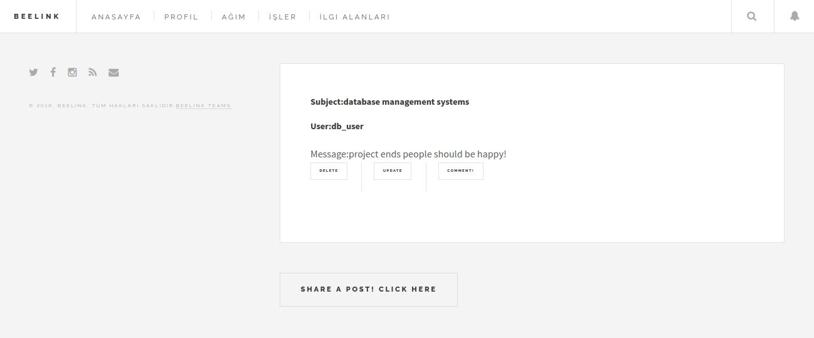
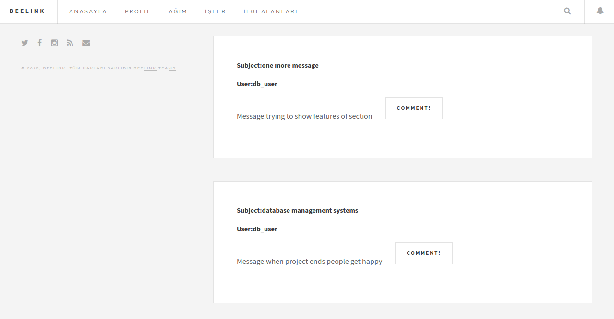
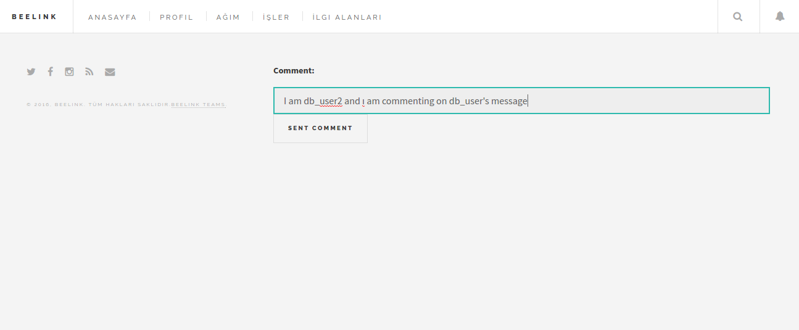
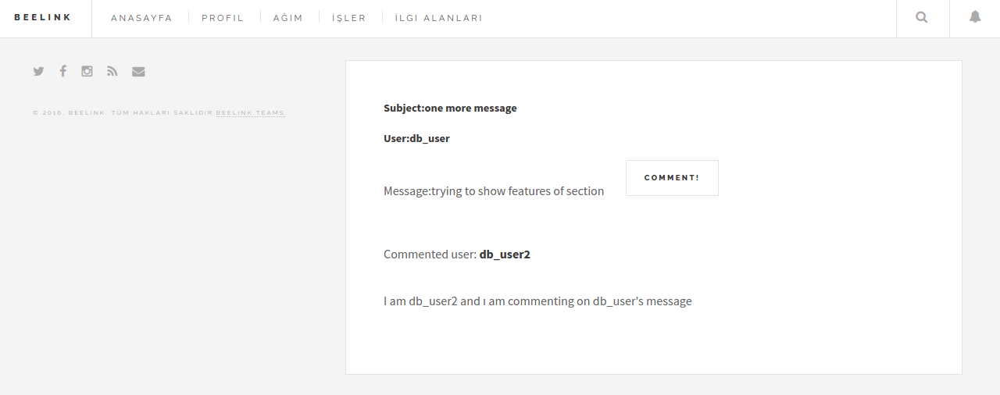
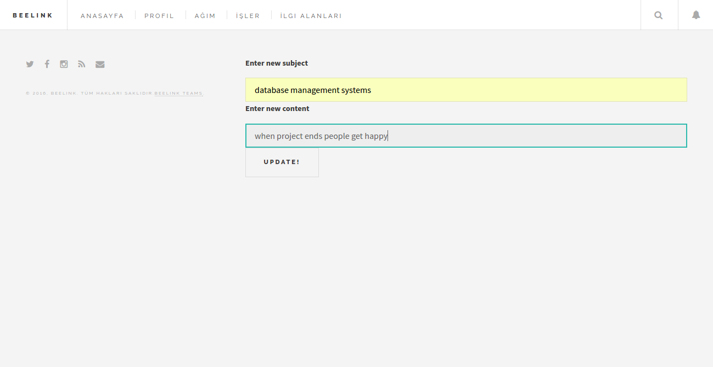
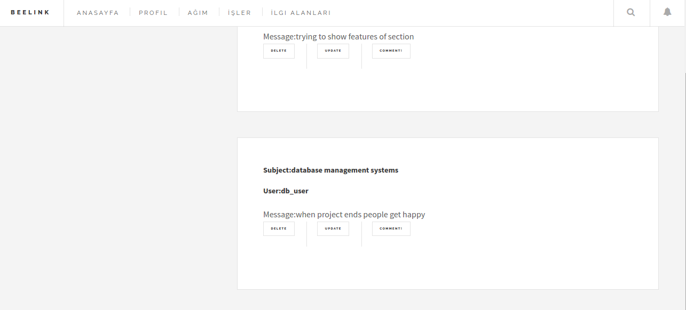
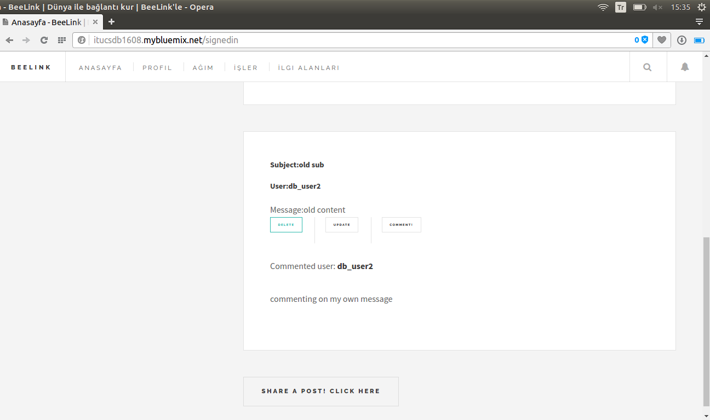
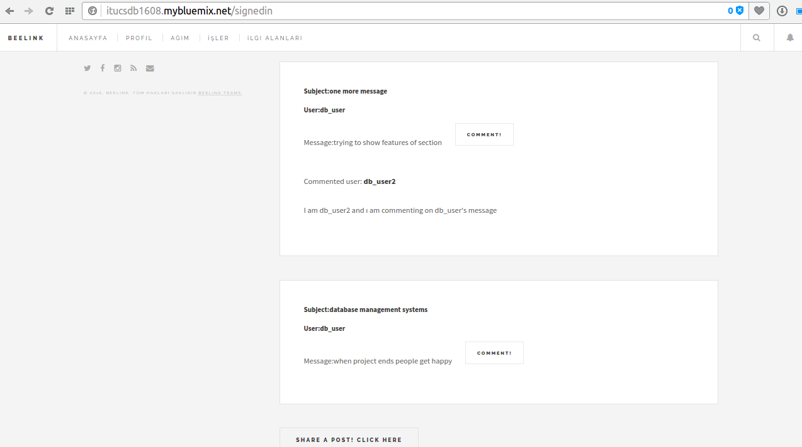

Parts Implemented by Furkan Artunç
==================================

**Zaman Tünelinde Paylaşım Yapma**

   Bu bölümde zaman tüneli ve burada yapılabilecek operasyonlar kullanıcı için anlatılacaktır. Kullanıcı ara yüz kısmındaki özellikler aktarılacaktır.
      
.. figure:: 1.png
   :figclass: align-center
   
   Resim 1: Mesaj gönderilmemiş boş zaman tüneli
   
   Resim 1’de sitede hiç paylaşım yapılmamış olduğundan boş bir zaman tüneli sayfası görülmektedir. Bu sayfada bulunan Share a post! Click Here butonuna basılarak mesaj paylaşımı yapılabilir. Bu butona basılmasının ardından kullanıcı mesajla ilgili içerikleri doldurmak için bir sayfaya yönlendirilmektedir. Bunların yanında sol üst köşede bulunan butonlardan BEELINK ve ANASAYFA butonları da zaman tüneli sayfasına yönlendirme yapmaktadır. PROFİL butonu kişisel profil sayfasına yönlendirme yapmakta ve AĞIM butonu ise arkadaş ilişkileriyle ilgili sayfalara yönlendirme yapmaktadır. Sol tarafta bulunan sosyal medya ikonları ise sosyal medya sitelerine yönlendirme yapması için tasarlanmış koyulmuştur.

   
   Resim 2: Bir adet mesaj gönderildikten sonra zaman tüneli görünümü
   
   Resim 2’de giriş yapan kullanıcının zaman tünelinde yaptığı paylaşımı nasıl gördüğü gösterilmiştir. Görüldüğü üzere mesaj üç ana elementten oluşmaktadır. Bu elementler mesaj konusu, mesaj içeriği ve mesajı gönderen kişinin kullanıcı adıdır. Burada örnek amaçlı db_user isimli kullanıcı seçilmiştir. Bu kullanıcı yaptığı mesaj üzerinde DELETE, UPDATE ve COMMENT butonlarını görebilmekte ve bu butonları gerektiği ve istediği şekilde kullanabilmektedir. Bu kullanıcı eğer mesajıyla ilgili bir değişiklik yapmak isterse UPDATE butonuna basıp güncelleme sayfasına yönlendirilmektedir. Bu sayfada güncelleme yapmak için içerik bilgileri kullanıcıdan alınmakta ve bu bilgilerin gönderilmesiyle tekrar zaman tüneli sayfasına yönlendirilen kullanıcı zaman tünelinde güncellenmiş mesajı görebilmektedir. Kullanıcı eğer mesajı silmek isterse DELETE butonuna basarak mesajını zaman tüneli sayfasından kaldırabilir. Bu işlem için başka herhangi bir sayfaya yönlendirme yapılmamaktadır. Kullanıcı zaman tünelinde yer alan herhangi bir mesaja yorum yazmak isterse COMMENT butonuna basar ve bu sayfadan yorum mesajıyla ilgili içerik bilgisi doldurması için başka bir sayfaya yönlendirilir. Yönlendirildiği sayfada gerekli içerik bilgilerini doldurup o sayfadaki gönderme butonuna bastıktan sonra mesaj altına yorum yazılmış halde bulunan zaman tüneli sayfasına geri yönlendirilir. Böylece kullanıcı sayfa üzerindeki temel işlemleri başarmış olur.

   
   Resim 3: Farklı bir kullanıcının gözünden zaman tüneli
   
   Resim 3’te daha önce db_user isimli kullanıcının yaptığı zaman tüneli paylaşımlarının farklı bir kullanıcının bakış açısıyla nasıl görüldüğü gösterilmiştir. Giriş yapan kullanıcı diğer kullanıcıların yaptığı paylaşımlara ancak yorum yazabilmektedir. Farklı bir kullanıcı başka kullanıcıların mesajları üzerinde UPDATE ve DELETE butonlarını görememektedir. Bu özellik sayesinde kullanıcılar sadece kendi mesajlarını silebilir ve sadece kendi mesajlarının içeriğini değiştirebilirler.  Bir kullanıcı eğer yorum yapmak isterse bu kullanıcı içerik doldurmak için yorum sayfasında yönlendirilir ve orada alınan içerik sonucunda zaman tüneli sayfası güncellenir.

   
   Resim 4: Yorum için içerik doldurma sayfası
   
   Resim 4’te mesaj altına yazılmak istenen yorumun içeriği için gidilen sayfa görülmektedir. Bu sayfada gönderilmek istenen yorum kutucuğa yazılır ve SENT COMMENT butonuna basılır. Butona bastıktan sonra kullanıcı tekrar zaman tüneline gönderilir.

   
   Resim 5: Bir kullanıcının bir diğer kullanıcının mesajına yorum yapmış hali
   
   Resim 5’te db_user2 isimli kullanıcı db_user isimli kullanıcının mesajına yorum yapmıştır. Yorum ise Resim 4’te gönderilen mesajtan ibarettir. Yapılan yorum zaman tünelinde değişikliğe sebep olmuş ve yorumuyla birlikte mesaj bir bütün olarak zaman tünelinde gösterilniştir. Yorum kısmında ise yorumun içeriği yani mesajı ve yorumu yazan kullanıcının adı bulunmaktadır.

   
   Resim 6 : Mesaj güncelleme sayfası
   
   Resim 6’da zaman tüneline gönderilen mesajı güncellemek için yeni içeriğin alındığı sayfa gösterilmiştir. Burada doldurulan yeni içerikler UPDATE! butonuna basılarak gönderilir ve zaman tünelindeki bilgilerek buna göre güncellenir.

   
   Resim 7: Güncellenen mesajın zaman tünelinde güncel gösterimi
   
   Resim 7’de resim 6’da yapılan güncelleme içeriklerinden sonra mesajın zaman tünelinde görünümü gösterilmiştir.

   
   Resim 8: Kullanıcının yorum yazılan mesaj için silme butonuna gitmesi

   
   Resim 9: Silme işlemi ardından zaman tüneli
   
   Kullanıcı yorum yapılmış kendi mesajını sildiğinde mesaj yorumlarıyla birlikte zaman tünelinden kaldırılmıştır.
