Parts Implemented by Tuncay Demirbaş
================================

Profil Sayfası (Tuncay Demirbaş)
---------
Genel Bilgi
-------

Projenin bu kısmında, grup üyeleri arasında yaptığımız görevlendirme sonucu benim sorumlu olduğum kısım burasıdır. Kullanıcı gözünden size detaylı bilgi vermeye çalışacağım.

Genel olarak Benim alanım olan profile sayfasından bahsetmek gerekirse: 	  
Veri tabanı kodlamanın yanında görsel tasarımı da oldukça önem verdim. BeeLink sistemine üye olan kullanıcının, kendi kişisel bilgilerini girdiği ve kendi profil sayfasında blog yazabildiği bir alan oluşturdum. 

Projede istenilen bütün teknolojiler kullanıldı. Tasarım olarak HTML5,CSS, Bootstrap kullanıldı. 

http://itucsdb1608.mybluemix.net/profile/<user-name> sayfasını ve 
http://itucsdb1608.mybluemix.net/admin/ url ve uzantıları olan sayfaları dizayn ettim.

Profil sayfası görünümü
-------
Kullanıcı sisteme kullanıcı adı ve şifresiyle giriş yaptıktan sonra karşısına şöyle bir sayfa çıkacaktır.

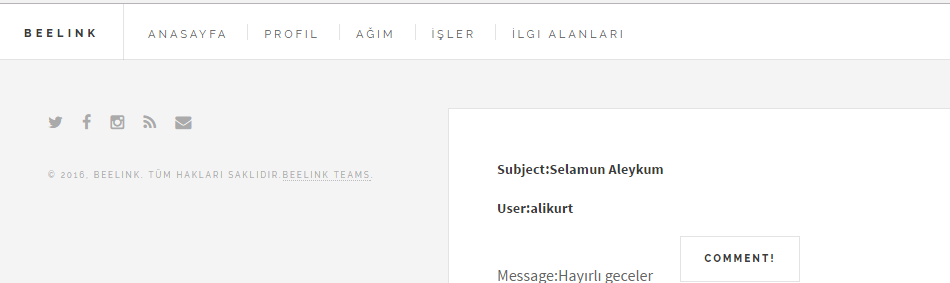
   
   Resim 1: Profil menü kısmı

Giriş yaptıktan sonra karşısına çıkan bu sayfadan kullanıcı, PROFİL yazan yere tıklayarak profil sayfasına geçiş yapacaktır. 
Buradan kullanıcı kendisi ile ilgili kişisel bilgileri vb. tüm bilgileri girerek kendisine ait bir profil oluşturacaktır.

Genel olarak profil sayfasını göstermem gerekirse şöyle bir sayfa çıkacaktır kullanıcı karşısına:

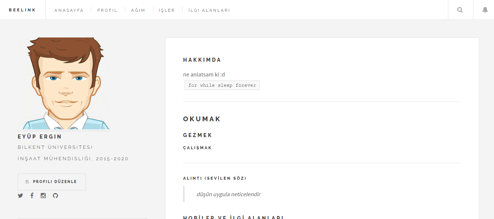
   
   Resim 2: Profil sayfası

Resim 2’den görüldüğü üzere gayet hoş bir tasarımsal çalışma ile kullanıcı dostu bir ara yüze sahip olan sayfam, kullanıcı kendi kişisel bilgilerini girmesiyle daha da bir güzelleşmektedir. 

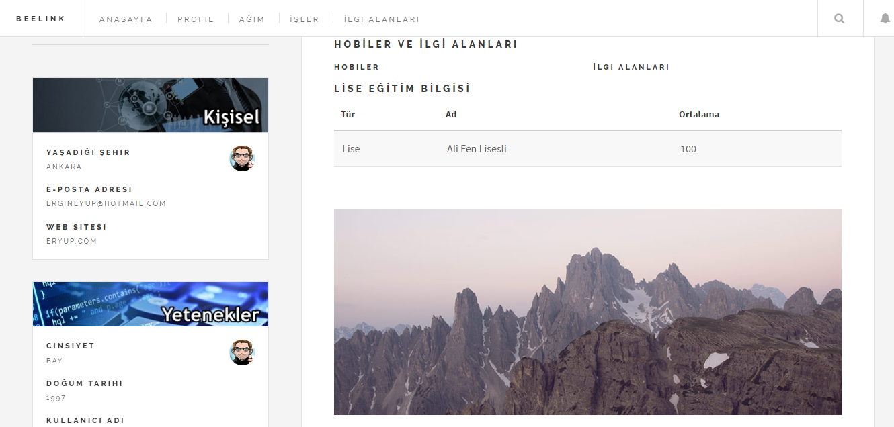
 
   Resim 3: Profil sayfası devamı

Resim’3 de mevcut profil sayfasının devamı gösterilmiştir.
 
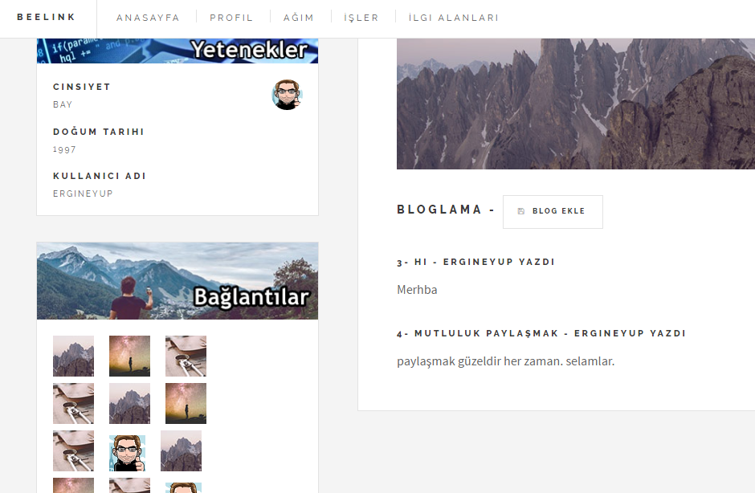
   
   Resim 4: Profil sayfası devamı

Resim 4’ de mevcut profil sayfasının devamı gösterilmiştir ve en altta kısımda kullanıcı kendi profil sayfasına ilişkin sınırsız sayıda blog yazısı ekleyebilir. Her kullanıcının kendi kişisel blog yazısı profilinde gözükür.
Resim 2, 3, 4 ‘de gözüken kısımları kullanıcı Profili düzenle butonuna basarak güncelleştirebilir.
 
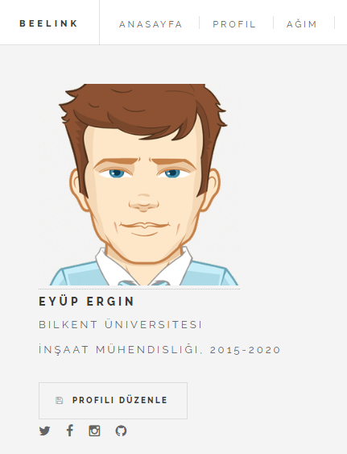
   
   Resim 5: Profili Düzenle botunu
    
Ayrıca kullanıcı profil menüsüne basıp, kişisel sayfasına geçiş yaptığı sırada URL kısmı şöyle olacaktır:
 
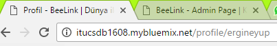
   
   Resim 6: Profil Link kısmı

Resim 6’da görüldüğü üzere http://itucsdb1608.mybluemix.net/profile/<user-name> linki oluşacaktır. <user-name> kısmına giriş yapan kullanıcının username’i gelecektir.
Kullanıcı PROFİLİ DÜZENLE butonuna basarak, profil yönetim paneline geçiş yapacaktır.
 
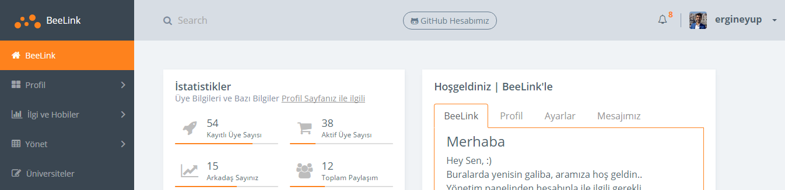
   
   Resim 7: Profili düzenle sayfası

Resim 7’de gözüktüğü üzere kullanıcı http://itucsdb1608.mybluemix.net/admin/home sayfasına geçmiş olacak ve böyle bir görüntü karşısına çıkacaktır.
Kullanıcı buradan solda bulunan menüler arası geçiş yapabilir.
Menüler sırayla şu içeriklere sahiptir.

1.	Profil

a.	Kişisel Bilgiler (Profildeki bilgileri düzenleme kısmı)
b.	Tanıt Kendini (Profildeki bilgileri düzenleme kısmı)
c.	Bloglama (Profile blog eklemek silmek düzenleme kısmı)

2.	İlgi ve Hobiler

a.	İlgi Alanı Ekle (Profil sayfasına ilgili alanı ekleme kısmı)
b.	Hobi Ekle  (Profil sayfasına hobi ekleme kısmı)

3.	Yönet

a.	Hobileri Yönet (Mevcut hobi listesindeki hobileri düzenleme kısmı)
b.	İlgi Alanlarını Yönet (Mevcut ilgi alanı listesindeki kısımları düzenleme kısmı)

Sırayla ilk menüden başlarsak:

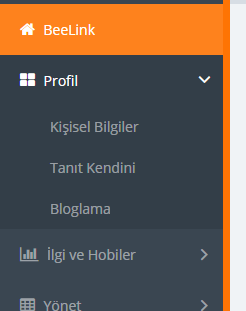
   
   Resim 8: Menü kısmı

Resim 8’deki görüntüden anlaşılacağı üzere, kullanıcı Profil menüsü sekmesi altında karşısına çıkan seçeneklerden Kişisel Bilgiler kısmına tıkladıktan sonra karşına şöyle bir sayfa çıkar.
 
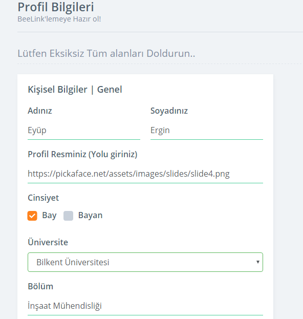
   
   Resim 9: Kişisel bilgiler güncelleme kısmı
   
Yukarıdaki resimdeki kısım Kişisel bilgiler güncelleme kısmı

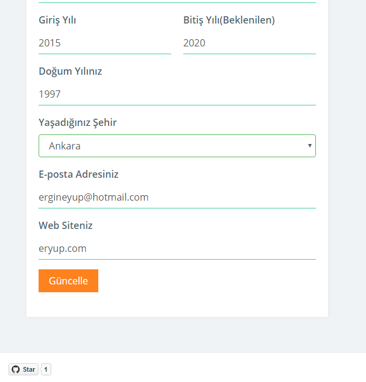
   
   Resim 10: Kişisel bilgiler güncelleme kısmı devamı

Resim 9 ve 10 ‘da görülen Profil Bilgileri -> Kişisel Bilgiler kısmında kullanıcı profil sayfasındaki mevcut bilgileri güncelleyebilir.
Sırayla Kişisel Bilgiler kısmında bulunan bilgiler şöyle
•	Adınız
•	Soyadınız
•	Profil Resminiz
•	Cinsiyet
•	Üniversite
•	Bölüm
•	Giriş Yılı
•	Bitiş Yılı(Beklenen)
•	Doğum Yılınız
•	Yaşadığınız Şehir
•	E-posta Adresiniz
•	Web Siteniz

Bu bilgiler kullanıcı BeeLink’e üye olur olmaz oluşur, ve default olarak NULL tanımlıdır. Bundan sebep kullanıcı sürekli bu bilgileri güncelleyebilir.
Kullanıcı daha sonra güncelleme işlemini tamamladıktan sonra Tanıt Kendini menü kısmına tıklar ve ilgili sayfaya girer:

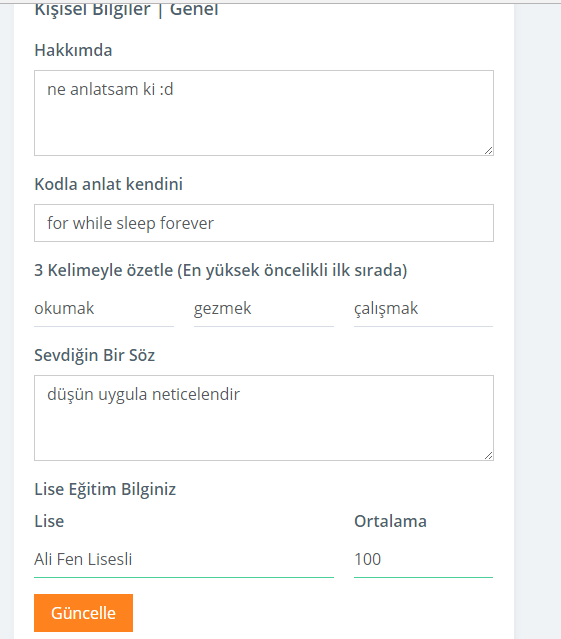
   
   Resim 11: Tanıt Kendini Sayfası

Resim 11 ‘de aynı şekilde kullanıcı profil sayfasındaki bilgileri güncellemek için bu kısımda gerekli bilgileri günceller.
Sırayla istenilen veriler:
•	Hakkımda
•	Kodla Anlat Kendini
•	3 Kelimeyle Özetle
•	Sevdiğin Bir Söz
•	Lise Eğitim Bilginiz
Sırayla kullanıcı, default olarak tanımlı bu bilgileri günceller.

Daha sonra kullanıcı Aynı menüden Bloglama kısmında blog ile ilgili işlemleri yapar:

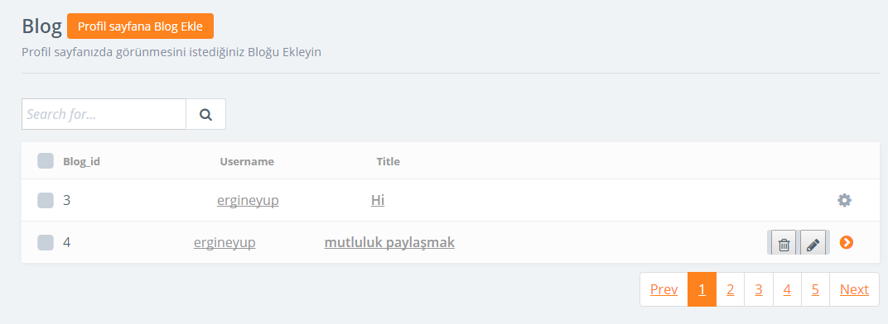
   
   Resim 12: Blog sayfası

Kullanıcı Blog sayfasında kendi profil sayfası için istediği kadar blog ekler.
Eklediği bloğu silebilir, güncelleyebilir.
Blog Eklemek için, Profil sayfasına Blog Ekle butonuna tıklaması yeterli.
 
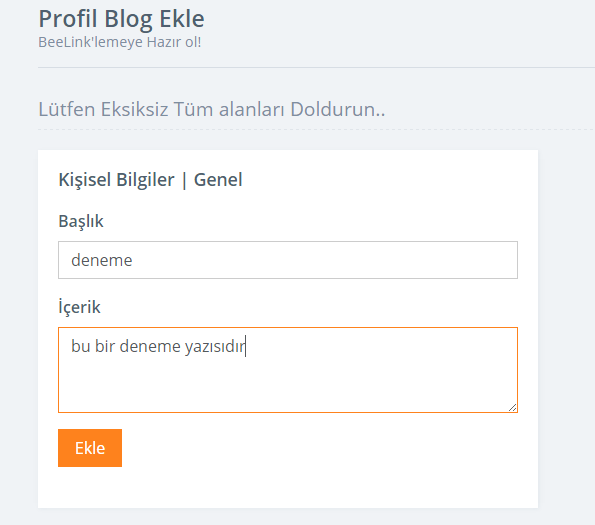
   
   Resim 13: Blog Ekleme

Resim 13 ‘de de görüleceği üzere kullanıcı Blog ekle butonuna bastıktan sonra blog ekleme sayfasına yönlendirilecek ve sırasıyla
•	Başlık
•	İçerik
Bilgilerini girerek ilgili kullanıcının profil sayfasına blog sayfası eklenir Resim 14’deki gibi.

   
   Resim 14: Blog Ekleme işlemi sonrası

Blog Eklendikten sonra kullanıcı ilgili blog kaydının sonunda bulunan ayarlar gibi bir ikon gözüken butona tıkladığında karşısına 2 seçenek çıkacaktır. Sil ya da Güncelle.
 
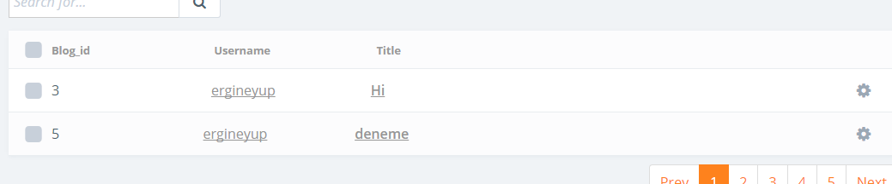
   
   Resim 15: Ayarlama

Kullanıcı 4 numaralı kaydı sildikten oluşacak tablo şöyledir:

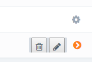
   
   Resim 16: Blog Silme

Aynı şekilde Kullanıcı ilgili kaydı rahatlıkla güncelleyebilir.

Böylelikle kullanıcı Profil Bilgileri menüsünü tamamlamış oldu, 
Şimdi İlgi ve Hobiler menüsüne geçecek olursak:
 
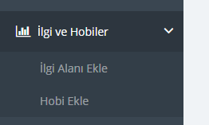
   
   Resim 17: Menü

Kullanıcı Resim 17’de de gözüktüğü üzere İlgi Alanı Ekle menüsüne tıkladığında karşısına şöyle bir sayfa çıkacaktır:

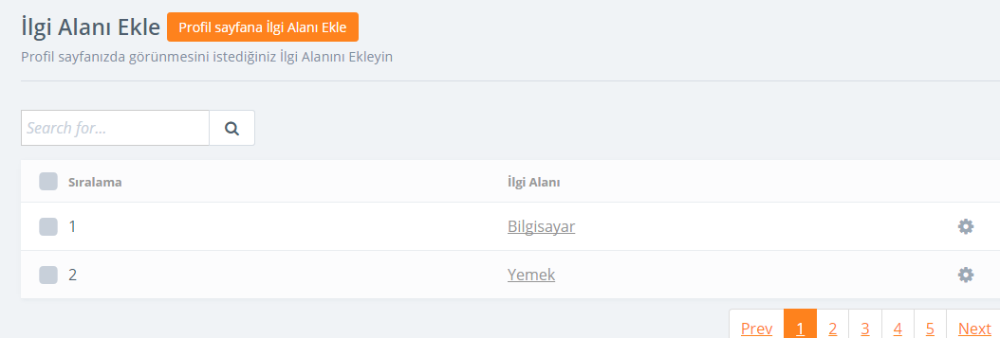
   
   Resim 18: İlgi alanı sayfası
   
Kullanıcı buradan profil sayfasında gözükmesini istediği İlgi alanlarını ekleyebilir. Daha sonradan vazgeçtiği bir ilgi alanını listeden çıkarabilir, sil butonu sayesinde.
Kullanıcı profil sayfasına ilgi alanı ekle butonuna tıkladıktan sonra karşısına şöyle bir sayfa çıkacaktır: Resim 19 ‘da gözüktüğü gibi.

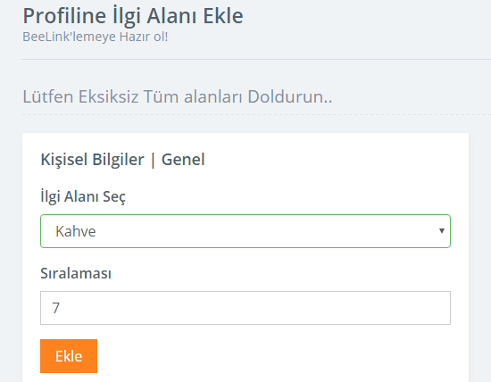
   Resim 19: İlgi alanı ekleme

Kullanıcı İlgi alanı seç HTML formundan istediği ilgi alanını seçip ve öncelik sırasına göre herhangi bir sıra numarası da vererek ekleme işlemini tamamlamış olur.
Ekledikten sonraki görüntü şöyle olacaktır:
 
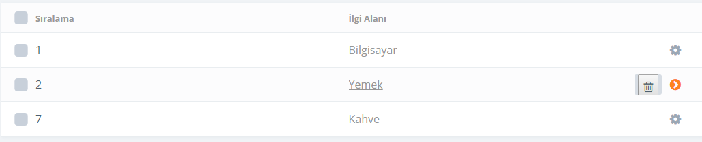
   
   Resim 20: Ekleme işlemi
   
Ekleme işlemi sonrası, kullanıcı silmek isteyeceği bir ilgi alanının sonunda bulunan sil butonuna tıklayıp silme işlemini başarılı bir şekilde gerçekleştirmiş olur.
 
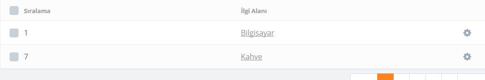
   
   Resim 21: Silme işlemi
   
Silme işlemi sonrası Resim 21’de gözüken tablo ortaya çıkacaktır.
Kullanıcı daha sonra Hobi menüsüne geçerek profil sayfasına hobi eklemek isteyebilir.

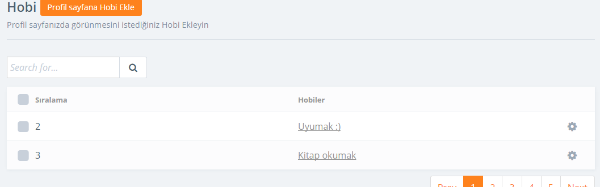
   Resim 22: Hobi sayfası
   
Kullanıcı Profil sayfasına eklemek istediği hobiyi Resim 22 ‘de gözüktüğü üzere, profil sayfasına Hobi ekle butonuna basarak gerçekleştirebilir.
Ekle butonuna bastıktan sonra, kullanıcının karşısına şöyle bir tablo çıkacaktır. Resim 23 ‘de gözüktüğü gibi.

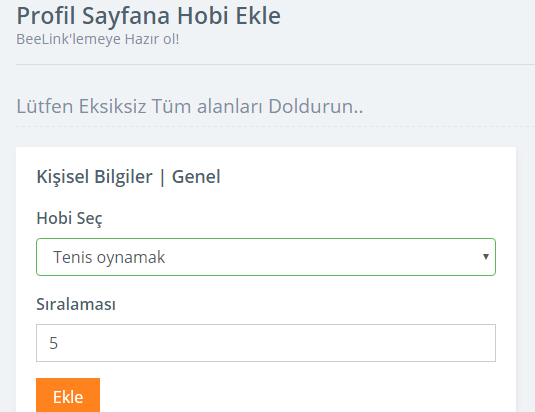
   
   Resim 23: Hobi ekleme sayfası
   
Kullanıcı, hobi seç kısmında karşısına çıkan hobi seçeneklerinden istediği hobiyi seçerek ve ilgili bir sıralama numarası vererek, öncelik sırasına göre sıralayabilir.
Ekleme işlemi sonrası: 

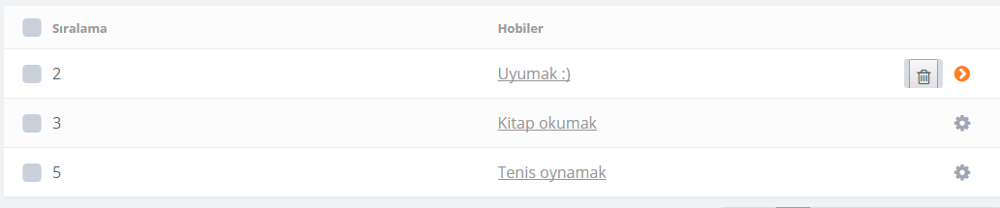
   
   Resim 24: Hobi sayfası ekleme sonrası
   
Ekleme işlemi sonrası, kullanıcı istediği hobiyi silebilir.
İlgili hobi kaydının sonunda bulunan Sil butonuna basarak, silme işlemini başarıyla gerçekleştirmiş olur.
Silme işlemi sonrası:

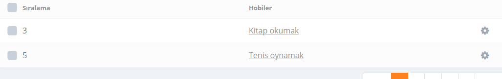
   
   Resim 25: silme işlemi
   
Silme işlemi sonrası Resim 25’de gözüken görüntü ortaya çıkacaktır.

Böylelikle İlgi ve Hobiler menüsü de tamamlanmış oldu.
Kullanıcı az önce profil sayfasına eklediği ilgi alanı ve hobileri yönetebilir. Şöyle ki, ilgi alanı ekle kısmında karşısına çıkan ilgi alanları ya da hobi ekle kısmında karşısına çıkan hobileri Yönet Menüsünden yönetebilir.
 
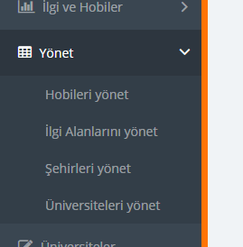
   
   Resim 26: Yönet Menüsü
   
Resim 26’da gözüktüğü üzere hobileri yönet menüsüne ya da ilgi alanlarını yönet kısımlarından düzenlemek eklemek istediği ne varsa yapabilir kullanıcı.
 
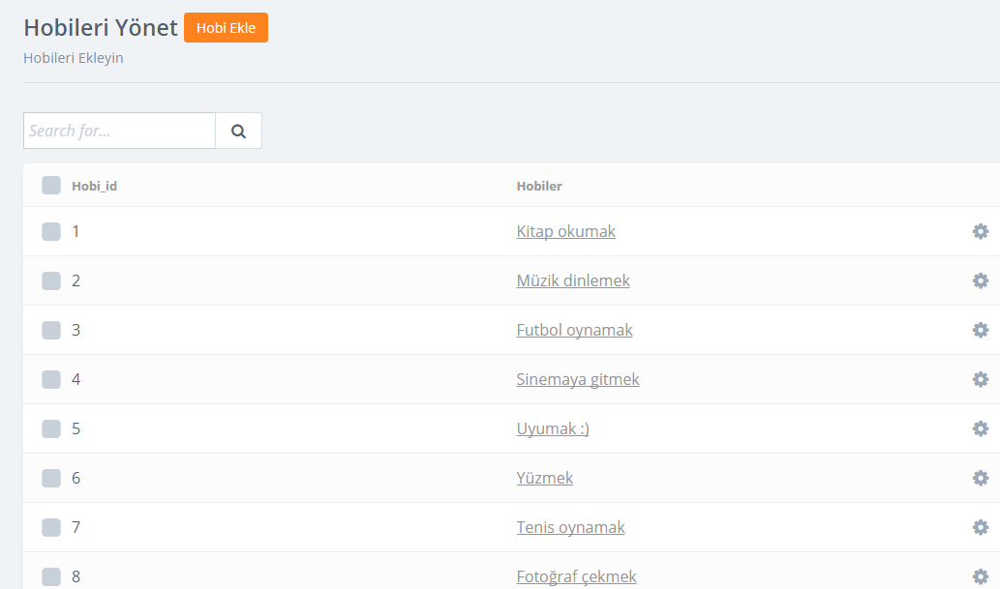
   
   Resim 27: Mevcut hobileri yönet sayfası

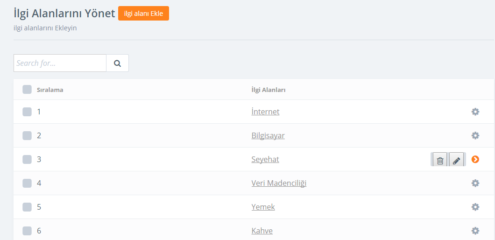
   
   Resim 28: Mevcut ilgi alanlarını yönet sayfası

Kullanıcı Resim 27 ve 28 ‘de bulunan sayfalar kısmından istediği alanı silebilir, düzenleyebilir, yeni bir alan ekleyebilir.

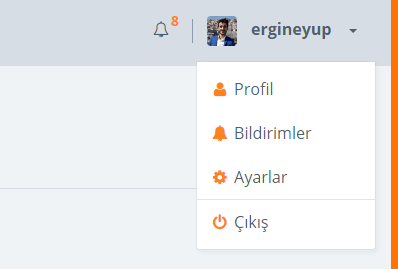
   
   Resim 29: Bildirim menüsü

Kullanıcı, Yönetim panelinde sol üst köşede bulunan kullanıcı adı kısmına tıkladığında, karşısına Resim 29’da ki gibi bir menü çıkacaktır. 
Buradan kullanıcı Profil linki ile profil sayfasına gider ya da Çıkış düğmesine basarak sistem çıkış yapabilir.

